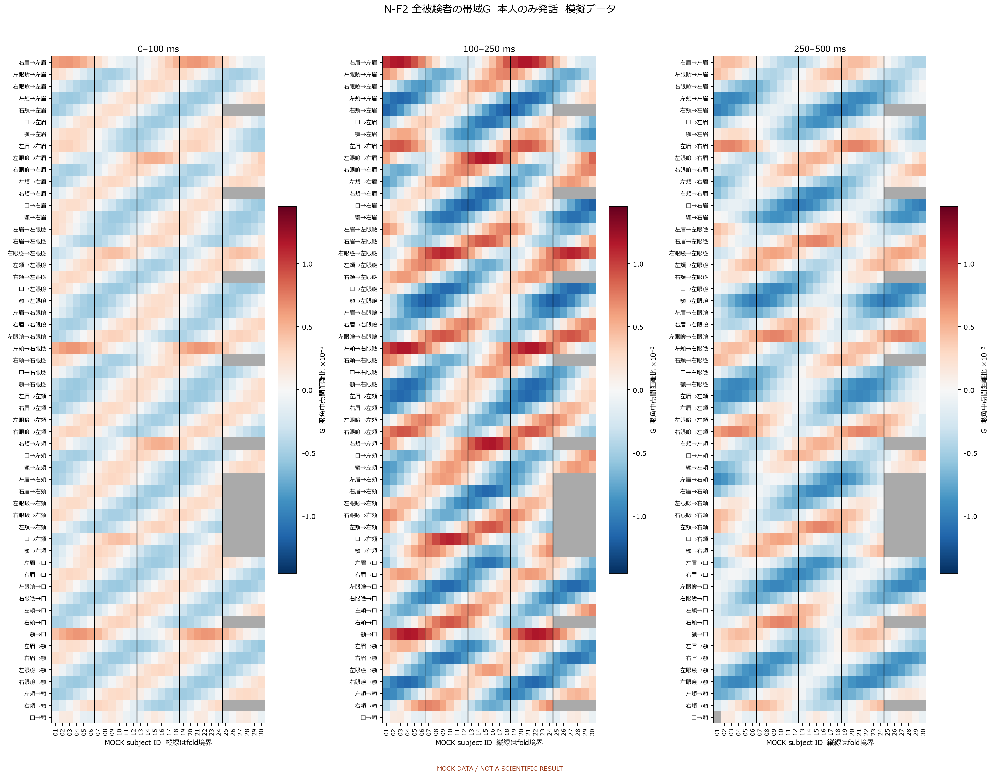
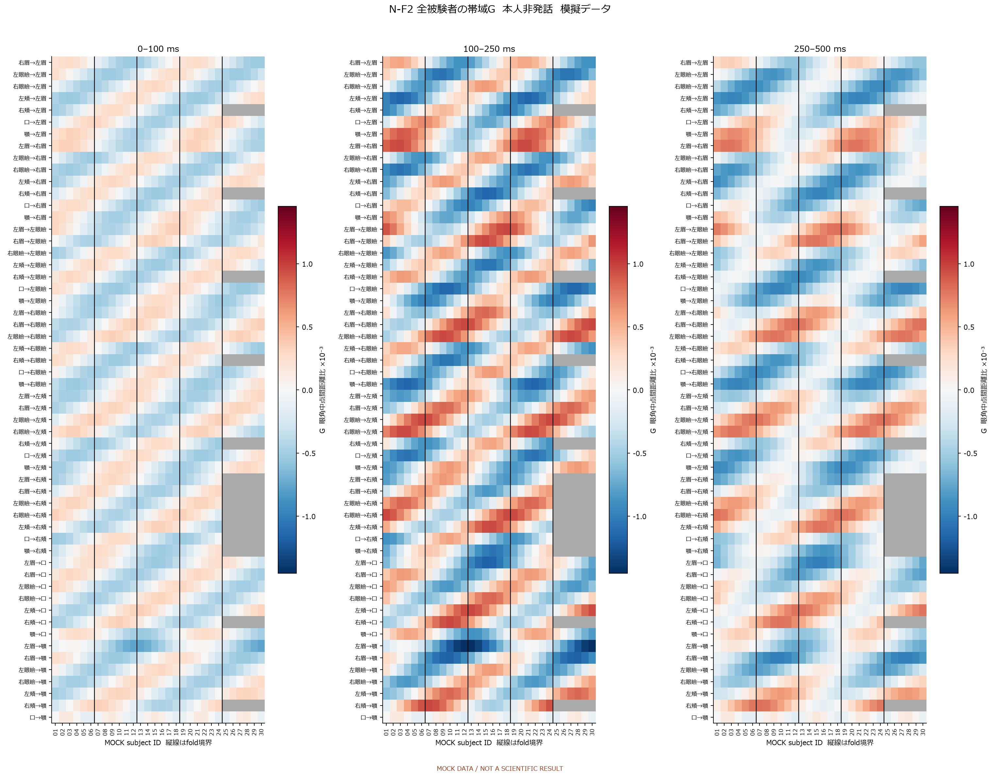
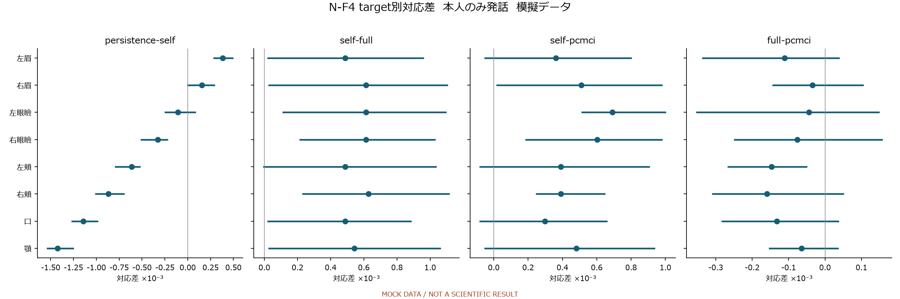
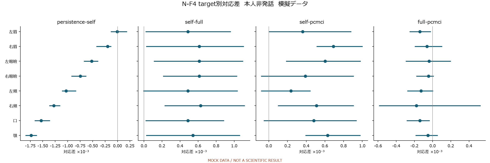
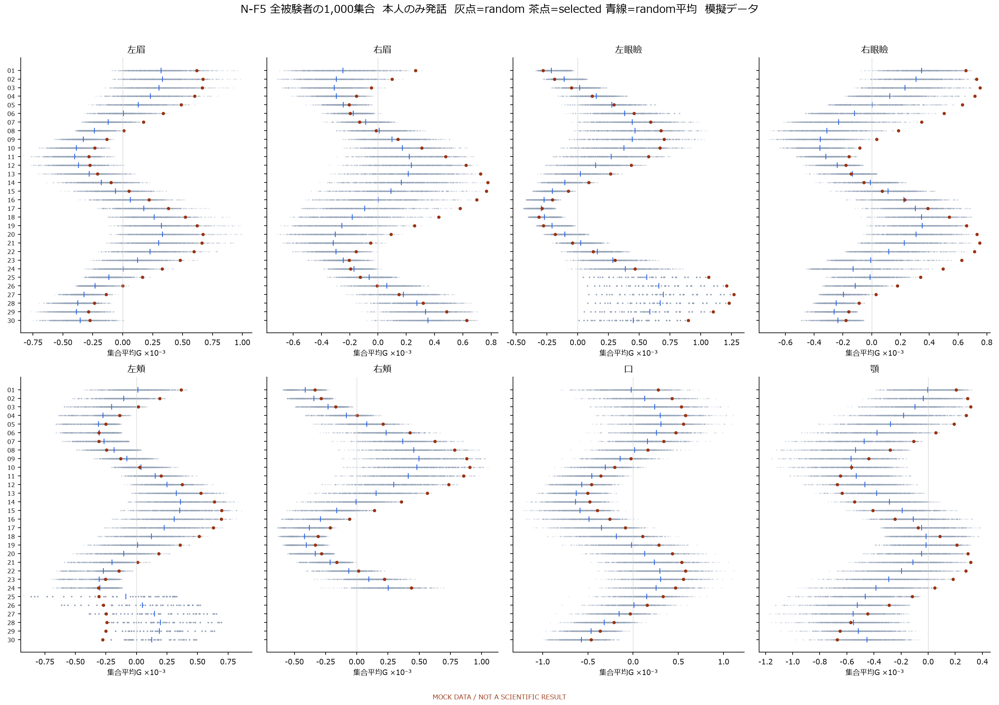
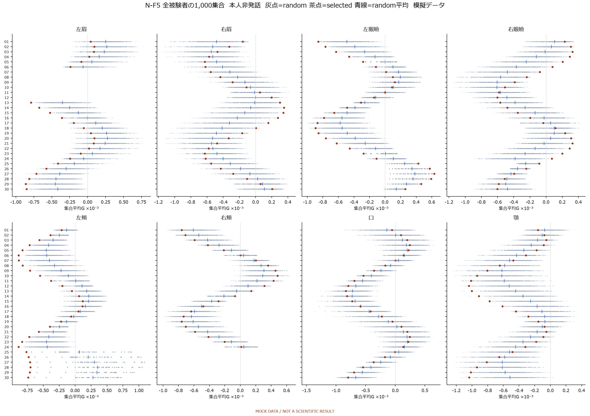
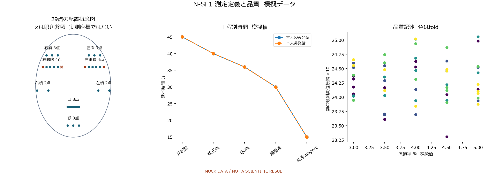
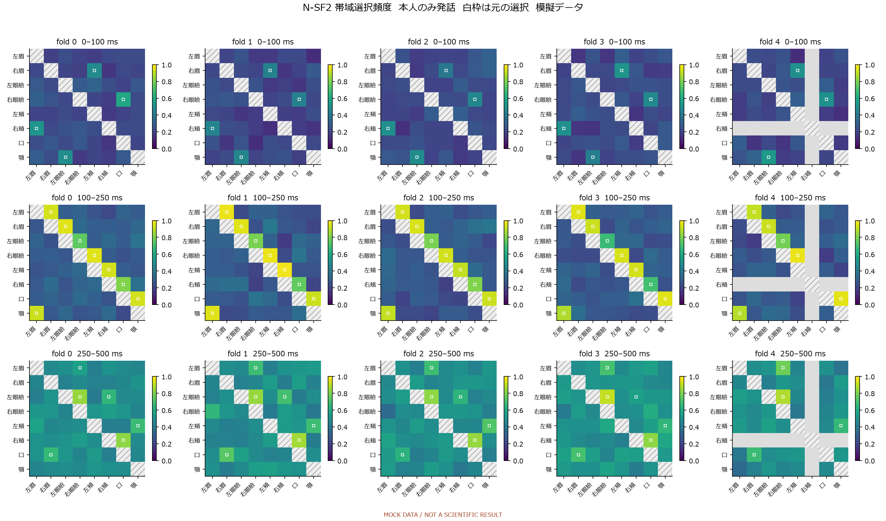
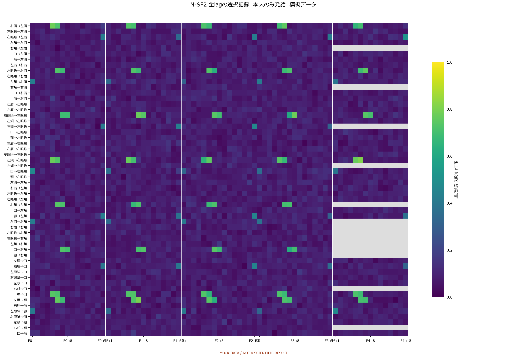
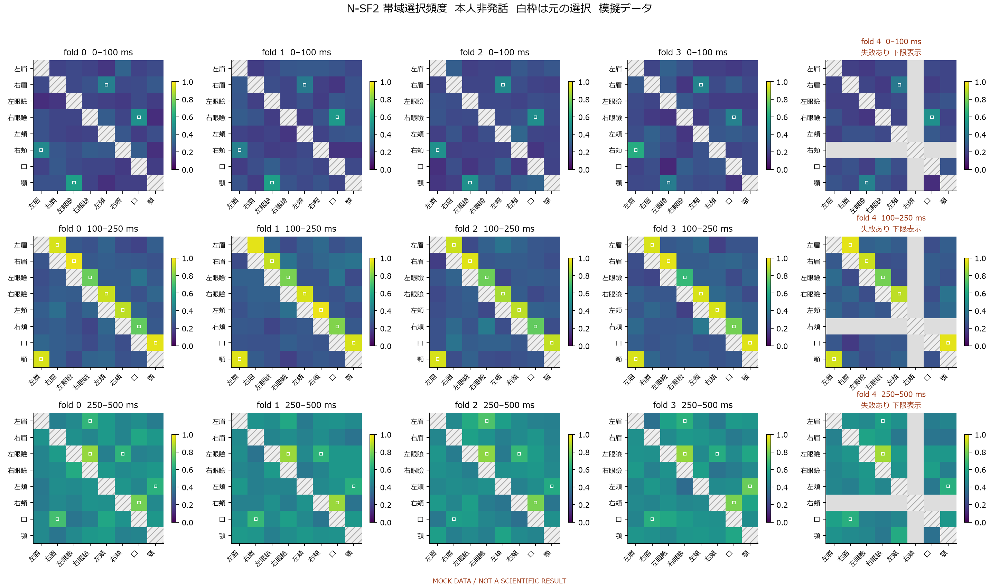

# 解析レポート草案 補足資料

**MOCK DATA / NOT A SCIENTIFIC RESULT**

[本文へ](analysis_report_draft.md)

## N-ST1 設定と測定点

| 項目     | 値                                 |
|:-------|:----------------------------------|
| 主指標    | displacement_mean_euclidean_error |
| 予測     | h=1 / 30 fps 模擬設定                 |
| 他部位lag | 1–15 frame                        |
| Self履歴 | 30 frame                          |
| 中心化幅   | ±3 frame                          |
| ランダム集合 | 1,000 / 実成分数層化                    |
| 集団区間   | 10,000 / fold内group抽出             |
| 選択履歴   | 100回の模擬記録                         |
| 実学習    | 未実行                               |
| 科学的受容  | 未実施                               |

| 領域   | 点index                            |   点数 |   成分数 |
|:-----|:----------------------------------|-----:|------:|
| 左眉   | 336, 296, 300                     |    3 |     6 |
| 右眉   | 107, 66, 70                       |    3 |     6 |
| 左眼瞼  | 385, 386, 380, 374                |    4 |     8 |
| 右眼瞼  | 158, 159, 153, 145                |    4 |     8 |
| 左頬   | 425, 280                          |    2 |     4 |
| 右頬   | 205, 50                           |    2 |     4 |
| 口    | 61, 291, 13, 14, 37, 267, 84, 314 |    8 |    16 |
| 顎    | 176, 152, 400                     |    3 |     6 |

全点の具体的配置と抽出品質は未確認。図は概念図である。以下の実数値表を先に保存し、その値から描画した。

## 補足図

### N-F2 全被験者の帯域G  本人のみ発話

### N-F2 全被験者の帯域G  本人非発話

### N-F4 target別対応差  本人のみ発話

### N-F4 target別対応差  本人非発話

### N-F5 全被験者の1,000集合  本人のみ発話  灰点=random 茶点=selected 青線=random平均

横は集合平均G、縦はMOCK subject ID。反復は人数ではない。失敗・空選択を0にしない。

### N-F5 全被験者の1,000集合  本人非発話  灰点=random 茶点=selected 青線=random平均

横は集合平均G、縦はMOCK subject ID。反復は人数ではない。失敗・空選択を0にしない。

### N-SF1 測定定義と品質

点配置は概念図。実topologyや追跡品質の確認ではない。QC時間は模擬値。

### N-SF2 帯域選択頻度  本人のみ発話  白枠は元の選択

100回の模擬選択記録。PCMCI再探索を実行した結果ではない。失敗時は下限k/N、上限はCSV。

### N-SF2 全lagの選択記録  本人のみ発話

### N-SF2 帯域選択頻度  本人非発話  白枠は元の選択

100回の模擬選択記録。PCMCI再探索を実行した結果ではない。失敗時は下限k/N、上限はCSV。

### N-SF2 全lagの選択記録  本人非発話

## N-ST2 全数値表と再生成元

- [N_ST1_configuration.csv](tables/N_ST1_configuration.csv)

- [N_ST1_point_mapping.csv](tables/N_ST1_point_mapping.csv)

- [N_ST2_band_subject.csv](tables/N_ST2_band_subject.csv)

- [N_ST2_band_summary.csv](tables/N_ST2_band_summary.csv)

- [N_ST2_cell_summary.csv](tables/N_ST2_cell_summary.csv)

- [N_ST2_centered_edge_subject.csv](tables/N_ST2_centered_edge_subject.csv)

- [N_ST2_centered_subject.csv](tables/N_ST2_centered_subject.csv)

- [N_ST2_centered_summary.csv](tables/N_ST2_centered_summary.csv)

- [N_ST2_enrichment_repeats.csv.gz](tables/N_ST2_enrichment_repeats.csv.gz)

- [N_ST2_enrichment_subject.csv](tables/N_ST2_enrichment_subject.csv)

- [N_ST2_model_subject.csv](tables/N_ST2_model_subject.csv)

- [N_ST2_paired_subject.csv](tables/N_ST2_paired_subject.csv)

- [N_ST2_stability_band.csv](tables/N_ST2_stability_band.csv)

- [N_ST2_status_audit.csv](tables/N_ST2_status_audit.csv)

- [N_T1_dataset_support.csv](tables/N_T1_dataset_support.csv)

- [N_T2_model_errors.csv](tables/N_T2_model_errors.csv)

- [N_T2_paired_effects.csv](tables/N_T2_paired_effects.csv)

- [N_T3_boundary.csv](tables/N_T3_boundary.csv)

- [N_T3_enrichment.csv](tables/N_T3_enrichment.csv)

## 模擬予測の再構成

input/coordinates.npzに正解・直前値・単位残差を保存した。各metrics/cells行のcoordinates_keyで配列を引き、正解＋residual_scale×単位残差で予測を再構成できる。Persistenceはprevious配列である。supportは共通900frame。失敗・不能行の残差scaleを有効な成果として使わない。

- [cells.csv.gz](input/cells.csv.gz)

- [config.json](input/config.json)

- [coordinates.npz](input/coordinates.npz)

- [matched_memberships.csv.gz](input/matched_memberships.csv.gz)

- [metrics.csv](input/metrics.csv)

- [mock_discovery_history.npz](input/mock_discovery_history.npz)

- [quality.csv](input/quality.csv)

- [selection.csv](input/selection.csv)

- [subjects.csv](input/subjects.csv)

- [共有bootstrap抽出index](bootstrap_subject_indices.npy)

- [用途別seed](seed_registry.json)

- [図のcaptionと出典表](captions.json)
