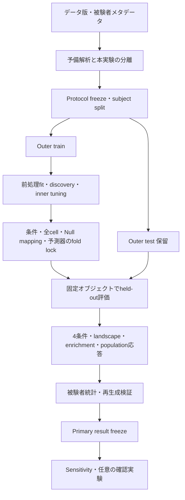

# 顔部位間遅延依存の一般化可能な予測構造：詳細設計

版：2026-09-10 / 正本整備版3対応（検証を既存工程へ統合）

科学上の正本は[実験計画](experimental_plan.md)。本書は新計画の実行に必要な設計を定める。既存実装の完了報告ではなく、旧詳細設計を基にした移行・実装契約である。科学的な未決値は実験計画D01〜D10に従い、実装者が補完しない。

## 1. 設計対象・根拠

対象は `shota5558/LaggedFacialGraphForecasting`。既存実装の参照点はdev commit `9bbc3d946c0a64935b8786d9413abe53e6cefe29`。packageは `lagged_facial_graph_forecasting` を維持する。旧DOCXの概念名 `facial_pcmci` に合わせたrenameや、保存先リポジトリのDDL仕様の流用は行わない。

原資料の名称・hash・優先順位は実験計画第1節に記載する。旧詳細設計から、薄いTigramite adapter、scikit-learn Pipeline、synthetic oracle、subject分離、Null invariant、artifact再生成、段階gateを継承する。新たにlandscape、selection enrichment、population-centered lag responseを必須工程へ追加する。

本書の「必要」「拒否」「保存する」は目標契約を表す。既存コードが既に満たしているという主張ではない。

## 2. 全体構造と実行境界



testを読み込む関数からdiscovery/tuning/mapping生成を呼べない責務分離にする。ファイルが分かれているだけでは隔離の証明にならないため、入力subject集合とprovenanceを実行時検証する。

固定frame-local処理と学習を伴う処理を分ける。全データに適用可能な決定論的変換でも、品質閾値・正規化参照を全被験者から推定しない。splitはfit処理より前に存在しなければならない。

### 2.1 既存コードの再利用単位

以下は参照commitで存在するmodule群であり、再利用候補である。名前が存在することを新契約適合の証拠にはしない。

|責務|既存module例|必要な作業|
|---|---|---|
|型・I/O|`core_contracts.py`, `core_contract_io.py`|region/成分と新解析provenanceの接続|
|データ・前処理|`landmark_io.py`, `spatial_normalization.py`, `region_aggregation.py`, `motion_features.py`|実データ定義とD02の接続|
|split・漏洩|`splits.py`, `leakage_guard.py`, `preprocessing_provenance.py`|全cell/Nullを含むfit scope検証|
|Discovery|`tigramite_adapter.py`, `pcmci_runner.py`, `pcmci_link_extraction.py`|既存adapter再利用、選択投影の明示|
|Design・予測|`design_matrix.py`, `forecaster.py`, `ridge_tuning.py`, `ridge_refit.py`|全条件・cell・edge摂動への共通適用|
|Null|`null_matched_sparsity.py`, `null_random_region.py`, `null_time_shuffle.py`, `null_lag_response.py`|1,000反復、edge estimand、境界契約|
|統計・分析|`primary_statistics.py`, `bootstrap_statistics.py`, `analysis_pipeline.py`|support一致、集約意味論、新3解析|
|実行・封印|`runner.py`, `experiment_manifest.py`, `scientific_fold_lock.py`, `sensitivity_execution.py`|全fold runner、export、結果freezeの統合|

新しい責務は必要な関数または小さなmoduleとして追加する。既存にない全fold本実験runnerを、Selfのみのrunnerやtest helperの存在から完成扱いしない。独自の学習器・分散scheduler・汎用plugin基盤は作らない。

## 3. Configとfreezeの設計

### 3.1 3段階のfreeze

|段階|固定内容|時点|
|---|---|---|
|Protocol freeze|D01〜D10、データ、split、候補、統計、Null規則、環境|本実験test評価前|
|Fold lock|fit済み前処理、親集合、alpha、モデル、mapping、学習subject|当該foldのtest評価前|
|Primary result freeze|全Primary出力、統計、図表、失敗台帳、hash|Sensitivity前|

`primary_frozen=true`や空markerだけでは封印を認めない。manifestの実在ファイル・hash・run/config/split識別子・完全性を検証する。中断runは中断状態のまま保存し、結果freezeへ進めない。

### 3.2 新configの必須内容

以下はschema設計項目であり、そのまま実行可能なYAMLではない。未解決値をnullや既定値で通さず、本実験用validatorは拒否する。

|ブロック|必須内容|
|---|---|
|identity|schema_version、protocol_version、run_id、code SHA、source文書hash|
|data|dataset/version/hash、subject/sequence、sampling、region mapping、feature/target、品質規則|
|split|outer/inner割当、予備解析との分離、seed、subject hash|
|primary|PCMCI+、ParCorr、Ridge、h=1、L、Self lag、discovery閾値|
|forecast|alpha grid、fit/tuning scope、score、tie-break、再利用単位|
|landscape|Ω manifest/hash、feature unit、target component、support policy、集約|
|matched_sparsity|repeat_count=1000、抽出母集団、特徴数単位、置換/重複規則、seed namespace|
|enrichment|estimand ID、Aggregate、順序・重み、空集合、Null比較法|
|population_response|estimand ID、E(e)文脈、Δ grid、境界/衝突、support、CI|
|statistics|指標式/向き、帯域、paired unit、bootstrap、安定性、多重比較|
|execution|失敗/除外/再実行、必要artifact、resume検証、計算資源上限|

### 3.3 旧freezeからの移行

参照commitのscientific freezeはschema v6で、matched sparsityは100回、lag-responseは全selected parentへのcommon shiftである。新計画は1,000回・edge-centered population解析を要求する。これは科学的変更としてschema/protocol版を上げ、変更理由を記録する。旧runを新runと表示し直さない。

旧設定のh=1、PCMCI+、ParCorr、Ridgeは継承可能。`tau_max=10`、`pc_alpha=0.01`、Δ=`[-2,-1,0,1,2]`、統計bootstrap 10,000回などは既存値であるが、新解析への採用が自動確定したわけではない。対応するD03/D07/D08で根拠と適用範囲を確認する。

旧v6のmatched反復誤差の中央値集約は、旧Nullモデル比較の規則である。新しいcell-G enrichmentのAggregateを決める根拠にはしない。100→1,000の定数変更だけで移行完了としない。

## 4. データ契約

### 4.1 既存の基幹型

|型|保持すべき情報|
|---|---|
|FaceTimeSeries|X(T,K,D)、subject、time_index、region_id、dimension、valid_mask、sampling_rate|
|SplitManifest|outer fold、train/test subject、inner fold、seed|
|ParentLink|source region、lag、source dimension、target dimension、および外側のtarget識別|
|DesignMatrix|X、y、subject/target、target_dimensions、origin/target time、feature名/lag、valid_mask|
|PredictionArtifact|真値・予測、条件、target dimensions、subject/fold、時点識別|
|MetricsResult|subject/region/metric/value/n_validと、対応する評価supportへの参照|

Core schema v3のX(T,K,D)を正規形とし、Tigramite入力の(T,N)はadapter内部形式とする。region、dimension、node indexの往復写像を保存し、dimensionを落としたcastで選択意味論を変えない。

Subject内の複数session/sequenceは追加metadataまたは明示的schema拡張で識別し、lagを境界越しに構成しない。非等間隔時刻やframe gapを単なる隣接配列要素として扱わない。

### 4.2 新解析で必要なrecord

以下は論理record。既存型を広範囲に変更する前に、既存artifactにhashで結びつくsidecar/tableで充足できるか確認する。新フィールドを導入する場合はschemaを明示する。

|Record|主なキーとpayload|
|---|---|
|CandidateGrid|grid_id、source、target、lag、source/target component、feature unit、protocol hash|
|EvaluationSupport|support_id、subject/sequence、origin/target time、target dimensions、採否・理由|
|LandscapeCell|run/fold/subject/h、cell_id、E_self、E_cell、G、metric、support_id、model/config hash、status|
|SelectedCellMapping|fold、raw parent ID、cell ID、投影規則、重複解消履歴|
|RandomSet|fold/target/repeat ID、seed、candidate IDs、feature count、mapping hash|
|EnrichmentRecord|estimand ID、subject/target、selected aggregate、repeat別random aggregate、差、support、重み|
|EdgeLagResponse|fold、edge ID、τ*、Δ、shifted τ、subject、E_ref/E_shift/difference、support、status|
|PopulationSummary|Δ、点推定・CI、n_subjects/n_edges、対象集合hash、集約/seed ID|

値が無いことと0を区別する。`failed`、`unevaluable`、`excluded_by_protocol`の理由を持たせ、NaNだけで意味を失わないようにする。

## 5. 前処理・Design matrix・予測

### 5.1 前処理

rawランドマーク、抽出器版、品質情報を保存する。処理順序は品質判定→空間正規化→領域集約→運動特徴→lag設計を基本とし、具体式はD02へ従う。マスクは元frame、差分に必要なframe、入力lag、targetまで伝播させる。

fitを伴う変換はtrainでfitし、testへ同一状態を適用する。各transformにfit subject hashと使用範囲を付ける。未来情報を使う中心差分・平滑化・補間を、forecast originで可用な特徴として通さない。

### 5.2 時点・特徴の構成

target time=u=t+h、source time=u−τで構成する。例としてh=1、τ=3ならsourceはt−2であり、t−3ではない。必ず`source_time ≤ forecast_origin`を検証する。

Self特徴を先に決定し、全条件に同一順序で渡す。Fullは全有効候補、PCMCIはSelfへinter-regional selected特徴を追加する。特徴IDを(region, dimension, lag)等の確定済み単位で管理し、順序・重複解消を決定論的にする。

領域blockとscalar選択の対応はD04が解決するまで本実験を止める。scalar parentが1つあることを理由に、未選択の同領域成分を暗黙追加しない。

### 5.3 評価support

比較するモデル間でsubject、sequence、target時点、target成分の集合を一致させる。n_validの一致だけでは不十分であり、整列済みキー一覧またはそのdigestを比較する。

support決定は予測誤差を見ず、凍結した品質・可用性規則で行う。testの品質maskを凍結規則へ適用することはできるが、性能の悪いframeを後から除外しない。

Landscapeのcell対Self、enrichment集合比較、Δ曲線全体、4条件比較それぞれのsupport policyを識別する。比較範囲を跨いで同じSelf誤差を再利用する場合はsupport hashが同一であることを確認する。共通集合の定義自体はD07/D08/D10でfreezeする。

### 5.4 RidgeとPersistence

StandardScalerとRidgeはscikit-learn Pipelineを使用する。alpha候補・スコア・tie-break・fit範囲を外から明示的に渡す。同じ入力、alpha、環境で決定論的に予測を再現する。

各条件・cell・repeat・shiftの学習は同じ予測器規則を使う。モデル共有はfeature set、train rows、target、alpha、preprocessingが同じ場合に限定し、cache keyへこれらのhashを含める。

Persistenceの式はD02で固定する。速度targetへ位置copy-lastを渡すようなshapeだけ整った実装を拒否する。単位とtarget dimensionをテストする。

## 6. Discoveryと安定性

Tigramiteへouter-trainの各sequenceを複数時系列として渡し、subject間を単純連結しない。ParCorr、PCMCI+設定、lag符号変換、contemporaneous出力の扱いを記録する。予測に使う直接観測parentはτ≥hに限定する。

raw graph、p_matrix、val_matrix、node mapping、抽出前後のparentを保存する。region-level図の投影は推定入力そのものと区別する。

Synthetic oracleで、既知の方向とlag、自己回帰、無関係系列、欠損、subject境界、h>1を検証する。確率的discoveryについて単一seedで全edge完全一致を一般保証にしない。lag変換等の決定論的契約と、事前設定したDGPでの回収特性を分ける。

Outer-train bootstrapのblock長・反復数・再標本化単位はD08に従う。selection frequencyにはeligible回数と成功回数を保存し、失敗bootstrapを分母から暗黙除外しない。fold間頻度も各foldで選択可能だった候補と投影規則を明示する。

## 7. 4条件とlandscapeの実行

### 7.1 4条件

各fold×target×held-out subjectでPersistence/Self/Full/PCMCIを評価する。予測値、真値、feature count、inter-regional count、選択edge数、support、モデルhashを保存する。全foldの直積に対して結果または事前規則による評価不能理由を要求する。

### 7.2 全候補landscape

1. Protocol freeze済みΩを読み込む。
2. 各cellのSelf+単一特徴集合を構成する。
3. Outer-train内でD05に従いtune/refitする。
4. Fold lockを検証してからouter-testを予測する。
5. 同一supportでSelf誤差とcell誤差を計算しGを保存する。
6. D08の規則で部位対・帯域・被験者を集約する。

Parentに選ばれていないcellも評価する。Gの大小でcellの実行順序・採否・候補gridを変更しない。セル数の見積りはscalar/block対応が確定した後に行う。全領域・連続lagであればregion-level候補数はK(K−1)(L−h+1)だが、成分や除外で変わる。

## 8. Matched sparsityとenrichment

選択集合のfeature countと同数のrandom集合を各対象単位で1,000反復生成する。抽出の置換、候補内重複、selected集合との重なり、target単位のmatchingはD06へ従う。seedを省略した場合は0へfallbackせず拒否する。

2つの出力経路を分ける。

- **Nullモデル比較**：Self+random集合を同時入力するRidgeを学習し、4条件との誤差差を評価する。
- **Landscape enrichment**：selected/random集合へ対応する単一cellのGを読み、確定済みAggregateで比較する。

前者のtableを後者の結果名で出力しない。Enrichmentのrecordにestimand ID、集約順序、重み、repeat IDを必須とする。成分投影が不明なselected parentは黙って落とさず停止する。

空selected集合では、4条件のPCMCIはSelfと一致し得る。一方、空集合のAggregateを0としてenrichmentの独立観測へ加えるか、評価不能にするかはD06の決定を要する。

1,000反復分布を保存したうえで要約する。repeatsを被験者数へ加えない。rank/p値を報告する場合は対応する交換可能性・Null仮説・計算式を事前確定し、単なるランダム集合分布を自動的に有効な検定へ変換しない。

## 9. Edge-centered population lag response

1. Foldの選択edgeを一意なIDとτ*で固定する。
2. 各edgeに同じ事前定義Δ gridを適用する。
3. source/target・入力数を保ち、D07のE(e)文脈で特徴を構成する。
4. τ*+Δが有効範囲にあるか、重複衝突がないか検証する。
5. 参照とshiftで同じsupportの誤差差を保存する。
6. 比較可能なedge/subject集合を固定してmedian_(e,s)を計算する。
7. D07/D08に従い95% CIと分母を算出する。

E(e)はSelf+edgeと、selected集合の1 edge置換では異なる。どちらを採るかが未決の間は、この本実験経路を有効化しない。設計上はcontext IDで区別し、1つに決定後は不要な汎用分岐を増やさない。

旧common-shiftは別estimand IDで残せるが、population曲線の必須出力を満たさない。境界でΔ gridを片側だけにしたり、0の参照集合と異なるedgeを比較したりしない。対象外率も結果とともに報告する。

## 10. Null・Sensitivity実行

Random-regionはlagと特徴数を保持し、自己領域への置換・重複の規則をfreezeする。Time-shuffleは適用partitionと操作対象を保存し、通常予測とは異なる破壊実験として識別する。保持・破壊する量を各Nullのテストへ落とす。

Phase/circular surrogate、GPDC、LPCMCI、h>1はPrimary結果manifestの検証後に実行する。入力するPrimary参照はrun IDとhashで指定し、別ディレクトリへ保存する。

Surrogateでdiscoveryを再実行する実験と、固定選択構造の予測価値だけを破壊する実験は目的が異なる。D09で採用範囲を固定する。h>1でτ<hの直接観測値を渡さない。GPDC/LPCMCIがRidgeや主対象を無断変更しない。

GRU/GNNは任意。Primary-only解析にSensitivity CSVやGRU artifactを必須入力として要求しない。

## 11. 統計・出力の再生成

### 11.1 統計入力の検証

Pairing keyはrun/protocol、fold、subject、target、h、metric、estimand、supportを含む。subject IDだけのmergeや、行数だけの一致を許可しない。重複キー、missing pair、異なる単位・指標方向を拒否する。

主指標はconfigで明示し、任意のlower-is-better指標へfallbackしない。matched反復のmean/medianは凍結済み解析規則に従い、table生成側で切り替えない。点推定とbootstrapで同じestimandを使う。

CI bootstrapはsubjectを再標本化し、被験者に付随するedge/regionを保持する。discovery bootstrapの引数とは別namespaceにする。seed、反復数、対象subject ID、CI方式を保存する。

### 11.2 必須出力

|出力|必要な内容|
|---|---|
|データ・QC表|被験者、sequence、frame、欠損・除外理由、sampling|
|4条件表|subject/region別誤差、paired効果、平均/中央値/CI、特徴数|
|Landscape表・図|全cell G、候補集合、support、部位対・帯域集約|
|Enrichment表・図|selected値、1,000反復分布、効果・CI、estimand|
|Population表・図|edge別差、Δ別中央値・95% CI、分母、frame/ms|
|Null比較|操作別結果、mapping、保持量、失敗率|
|安定性|train bootstrap/fold頻度、分母、部位・成分投影|
|実行監査|config/code/data hash、freeze履歴、失敗・再開、完全性|
|Sensitivity|Primary参照hash、変更点、独立結果、制約|

Core prediction/metricから解析tableへのexportは単一の検証経路を用いる。CSVを手編集して報告値を整えない。各集計値から元recordへ遡れるキーを残す。

## 12. Artifact・seed・再開

以下は論理配置例。既存artifact registryへ対応付け、同じ情報を別の正本として重複管理しない。

```text
artifacts/primary/<run_id>/
  manifest.json
  resolved_config.yaml
  environment.json
  seeds.json
  dataset_manifest.json
  splits.json
  candidate_grid.json
  failure_ledger.jsonl
  fold_<id>/
    fold_lock.json
    preprocessing/
    discovery/
    models/
    null_mappings/
    predictions/
    evaluation_support/
    subject_metrics/
    landscape/
    enrichment/
    edge_lag_response/
  summary/
    primary_tables/
    landscape/
    enrichment/
    population_response/
    stability/
    figures/
  primary_result_freeze.json
artifacts/sensitivity/<run_id>/
  primary_reference.json
  ...
```

Seedはsplit、discovery、inner tuning、matched repeat、random-region、shuffle、discovery bootstrap、CI bootstrap、Sensitivityで名前空間を分ける。決定論的導出にfold/target/repeatを含め、seed由来を記録する。

Manifestはartifact種別・相対path・hash・schema・producer code/config・状態を持つ。新3解析を必須artifact集合へ追加する。単なるファイル存在に加え、必要fold/cell/repeat/Δの完全性を検証する。

Resumeはrun/config/code/data/split/candidate/mapping hash一致時だけ許可する。不完全ファイルを完成扱いせず、一時出力からの確定書込みを使う。失敗履歴は追記し、成功結果で消さない。既存runの上書きによる条件変更を禁止する。

## 13. テストと受入条件

|ID|検証|合格条件|
|---|---|---|
|T01|時点oracle|h=1/τ=3のsource=t−2、h>1の未来parent拒否|
|T02|境界・mask|subject/sequence/gapを越えず、差分・lag・target欠損が伝播|
|T03|空間・単位|決定した正規化の不変性、速度/位置/Persistenceの整合|
|T04|Discovery adapter|raw node↔region/component、方向・lag符号が一致|
|T05|漏洩|test subjectのfit/discovery/tuning/mappingへの投入を拒否|
|T06|特徴集合|Self共通、包含関係、順序、空parent、scalar/blockが一致|
|T07|Support|同じn_validでも異なる時点ならpairing拒否|
|T08|Landscape|未選択候補を含む全Ω、既知の予測値からG再計算可能|
|T09|Enrichment|1,000 ID完全、特徴数一致、cell集約とjoint-model誤差を区別|
|T10|Population|Δ=0差0、edge整列、境界・衝突・共通集合、common-shift混入拒否|
|T11|統計|subject再標本化、凍結した集約順序、seed必須、重複キー拒否|
|T12|Freeze|booleanだけでは不可、hash改変・必要artifact欠落を拒否|
|T13|Primary-only|Sensitivity入力なしでPrimary報告可能|
|T14|再開・再生成|同一manifestから同じ数値、異なるconfigのresume拒否|
|T15|科学的dry run|全fold経路で4条件＋新3解析＋Null＋封印が接続|

テスト用の小さなrepeat数は単体・配線試験で明示的に使用できるが、Primary protocolの合格runと表示しない。本実験の反復完全性は1,000回で検証する。確率的oracleの回収閾値は結果を見て緩めず、DGP・seed・許容範囲を先に定める。

CIは実装の検証であり、実データ実行・解析・科学的受容の代用ではない。本Markdown作成時点で上記テストを新たに実装・実行したとは主張しない。

## 14. 実装順序とgate

|工程|作業・主成果物|依存・終了条件|
|---|---|---|
|P0|D01〜D10の科学判断、変更記録、新protocol schema|未決事項が当該工程に残らない|
|P1|Config移行・data/region/target契約・split|旧runと新runを識別、実データ読込可能|
|P2|前処理・design・support・synthetic oracle|T01〜T07、漏洩境界を通過|
|P3|Discovery・Ridge・4条件統合|全条件が同一規則で出力|
|P4|全候補landscape|全Ωとsource→target/帯域出力|
|P5|1,000反復matched・enrichment|D04/D06解消、T09を通過|
|P6|Edge-centered population response|D07解消、T10を通過|
|P7|他Null・統計・安定性・export|対応したsupportとseedで再生成|
|P8|全fold runner・完全性・結果freeze|T12〜T15、Primary-only経路成立|
|P9|実データPrimary実行・解析・受容|run ID/hash/SHA/結果/監査判断を記録|
|P10|Sensitivity・必要時GRU|Primary結果freeze検証済み|

旧I0〜I9は主にP0〜P3へ継承する。旧I10〜I13はP3〜P9へ拡張し、P4〜P6を欠いた状態でPrimary完了としない。旧I14〜I16はP10と将来の任意拡張へ対応する。

状態は `DESIGNED → IMPLEMENTED → SW_VALIDATED → READY_TO_RUN → EXECUTED → ANALYZED → ACCEPTED` で追跡する。mergeはこの状態列とは別の開発イベントである。

## 14.1 合成検証の既存工程への統合

[実験計画第15節](experimental_plan.md)に従い、独立3Dサブシステムの導入は取り消す。専用Stage 1、MV-D/MV-G、benchmark freeze、専用受容reportをP9の前提にしない。

P2〜P8で既存の小さな合成fixture・既知値を使い、T01〜T15を新仕様に合わせて確認する。特に空ParentSetでもΩを保持すること、G再計算、1,000反復、edge-centered整列・共通supportを検証する。旧100反復/common-shiftのテストは新仕様の検証に代用しない。

実データdry run・科学監査・D01〜D10は継続する。具体的な不具合に必要な回帰検証を追加し、汎用顔生成基盤や独立benchmark研究へ広げない。

## 15. 移行管理と責任分界

対象repoへ実装する際は、現行の対象repo規則を再確認し、devから責務ごとの作業branchを作成してPRを通す。監査に由来する科学妥当性・実行・provenanceの修正は、governing Issueと受入条件を先に記録する。文書の再構成だけで既存Issueを完了扱いしない。

実装上の修正と、科学仕様の決定を区別する。support不一致の拒否、seed必須化、manifest検証、Primary-only入力分離は契約を守る実装作業である。一方、cell単位、Enrichment Aggregate、E(e)文脈、帯域・成功基準は科学判断であり、性能改善を理由に実装者が決めない。

新たな実データ実行を受入条件とするIssueは、merge後も必要runが完了するまで開いた状態にする。記録にはrun ID、config hash、git SHA、結果artifact、監査dispositionを含める。

この文書一式の作成は、実行用freezeの更新、コード変更、commit、PR、実データ実験を実施したことを意味しない。次の作業は、D01〜D10の既決事項を根拠付きで埋め、対象repoでP0から順に移行することである。

