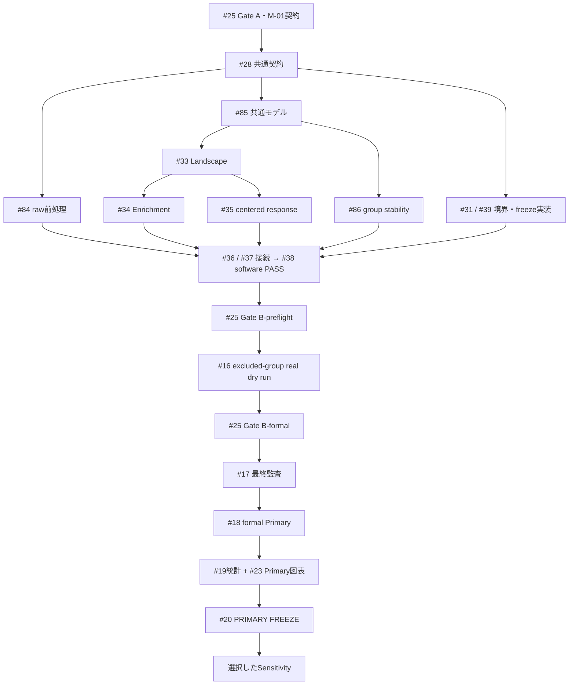

# 今後の実装・実行一覧（2026-09-12）

対象: `shota5558/LaggedFacialGraphForecasting`
確認基準: `main@3f681b16e8217c04e7dc814b031a531786161ef6`
管理入口: [Issue #24](https://github.com/shota5558/LaggedFacialGraphForecasting/issues/24)

**科学仕様は採用済み。実行コードへの移行、実データによる確認、本実験は別の完了段階である。** 本書は実装項目・担当・順序を整理し、科学的な設計値を追加しない。

科学上の正本は[正式仕様](https://github.com/shota5558/LaggedFacialGraphForecasting/blob/main/docs/authoritative_primary_experiment_spec_2026-09-12.md)と[採用済み詳細本文](https://github.com/shota5558/LaggedFacialGraphForecasting/blob/main/docs/primary_experiment_recommendation_2026-09-11.md)。Issueや旧文書と競合する場合は正本を優先する。

## 1. 現在の実装との差

以下はコードの静的確認に基づく。この整理では本実験・実NoXiの前処理・回帰テストを実行していない。

| 項目 | 現在確認できたもの | 残る実装 | 担当 |
|---|---|---|---|
| protocol/config | YAML・schema・loaderが旧v6、tau_max=10、旧4 Null、exact component | 採用仕様のversionへ同期、実値不足と旧artifactを拒否 | #25 M-01 |
| raw入力 | `landmark_io.py`は抽出済みnpy/npz | 動画decoder、MediaPipe IMAGE、実注釈adapter、CLI/runbook | #84 |
| 表現・測定 | 空間正規化・品質mask・assemblyのprimitive | 29点/参照眼角、QC、10秒校正、q_ref変位への接続 | #84 |
| displacement | `compute_displacement()`は隣接frame差分 | Primary `q(t)-q_ref`と意味を分け、旧出力の誤受入を拒否 | #84 / #28 |
| データ契約 | `FaceTimeSeries`とserializationの骨格 | 不均一な領域点数、point/x-y、group/session/sequence/condition、校正/QCの来歴 | #28 / #84 |
| split・入力 | 既存subject split・design matrix | dependency group、pilot永久除外、H、動的L、境界、OR block | #85 |
| Ridge | StandardScaler + Ridge、inner-CVの骨格 | scaler/lossの被験者等重み、主誤差によるalpha選択・同点処理 | #85 |
| 主解析 | `landscape.py`等の契約、`displacement_analysis.py`のsynthetic-only集計 | 実モデル・raw prediction・supportから現行estimandを生成 | #33 / #34 / #35 |
| stability | `pcmci_bootstrap.py`は時間block bootstrap | 100回のdependency-group再探索、別series copy、選択可能/失敗分母 | #86 |
| 出力・実行 | runner/registry/export/report/freezeの既存部品 | 現行scopeで接続、実CLI、漏洩防止、完全会計、再開・freeze検証 | #31 / #36–#39 / #23 |

29点mappingはsynthetic report側にも存在する。値の重複定義を増やさず、現行productionの設定・schemaから共通に参照する。

旧Issue #5/#6/#7/#10/#11/#15のclosedは旧契約の実装記録であり、この表の移行完了を意味しない。

## 2. 実施項目と優先順

P0は入口と共通契約、P1は個別解析、P2は接続を表す。実装期間の見積りではない。

| 優先 | Issue | 実施内容・完了時の成果 |
|---|---|---|
| P0 | [#25](https://github.com/shota5558/LaggedFacialGraphForecasting/issues/25) | M-01: config/schema/loader/validator同期。M/P証拠と実行前のhashを集約 |
| P0 | [#28](https://github.com/shota5558/LaggedFacialGraphForecasting/issues/28) | data/group/point/sequence、exact support、主誤差、OOF統計、reader/writerの契約を強制 |
| P0 | [#84](https://github.com/shota5558/LaggedFacialGraphForecasting/issues/84) | raw NoXi→注釈・MediaPipe・QC→校正/q_ref→canonical変位。CLIと操作手順 |
| P0 | [#85](https://github.com/shota5558/LaggedFacialGraphForecasting/issues/85) | group split、pilot H、動的lag、OR projection、等重みRidge、alpha・主誤差を共通経路へ移行 |
| P1 | [#33](https://github.com/shota5558/LaggedFacialGraphForecasting/issues/33) | 全候補Self+cellの予測・G、完全な候補会計、被験者別/帯域要約 |
| P1 | [#34](https://github.com/shota5558/LaggedFacialGraphForecasting/issues/34) | scalar成分数を合わせた1,000 random sets、cell-G集合平均Enrichment |
| P1 | [#35](https://github.com/shota5558/LaggedFacialGraphForecasting/issues/35) | M=floor(.1*fps)の完全対称grid、single-block応答、同一edge/subject/support、集約 |
| P1 | [#86](https://github.com/shota5558/LaggedFacialGraphForecasting/issues/86) | outer-train group100回再探索、scalar/block/band頻度、分母・失敗記録 |
| P1 | [#31](https://github.com/shota5558/LaggedFacialGraphForecasting/issues/31) / [#39](https://github.com/shota5558/LaggedFacialGraphForecasting/issues/39) | Primary-only独立性、freeze schema/writer/validator、real Sensitivity境界 |
| P2 | [#36](https://github.com/shota5558/LaggedFacialGraphForecasting/issues/36) | raw scientific artifact→canonical解析入力、source/support/hash照合 |
| P2 | [#37](https://github.com/shota5558/LaggedFacialGraphForecasting/issues/37) | 共通関数を接続するproduction runner/CLI、fold lock、再開・失敗台帳 |
| P2 | [#38](https://github.com/shota5558/LaggedFacialGraphForecasting/issues/38) | 実production compositionのsynthetic integration・leakage/完全会計検証 |
| 実データ | [#16](https://github.com/shota5558/LaggedFacialGraphForecasting/issues/16) | 永久除外preflight groupでrawから出力までreal-data dry run |
| 実行前 | [#17](https://github.com/shota5558/LaggedFacialGraphForecasting/issues/17) | formal outcomeを読まず、実行設定・隔離・再現性を最終監査 |
| 本実験 | [#18](https://github.com/shota5558/LaggedFacialGraphForecasting/issues/18) | 固定済み設定でformal Primaryを実行 |
| 集計 | [#19](https://github.com/shota5558/LaggedFacialGraphForecasting/issues/19) | 凍結OOF結果の集計・10,000 group bootstrap・数値検算 |
| 図表 | [#23](https://github.com/shota5558/LaggedFacialGraphForecasting/issues/23) Primary部分 | validated sourceから図表/manifestを生成、実成果を照合 |
| 凍結 | [#20](https://github.com/shota5558/LaggedFacialGraphForecasting/issues/20) | #39で実結果・統計・図表source・科学状態をPRIMARY FREEZE |

既存契約・学習器・reducer・rendererを再利用し、別の実験frameworkやrunnerを重複実装しない。#84/#85/#86の受入条件は各Issueに列挙した。

## 3. Gateと依存順

| Gate | 意味 | 次に進める作業 |
|---|---|---|
| #25 Gate A | U-01〜U-06と固定科学仕様は採用済み | config/契約/各componentの実装 |
| #25 Gate B-preflight | #38 software PASS、実入力/model/注釈/cadence/pilot除外とpreflight実行設定が揃う | #16の実データdry run |
| #25 Gate B-formal | M-01〜M-05、P-01〜P-06、#16 PASS、formal splitとhashが揃う | #17の最終監査 |
| #17 PASS | outcome非参照の最終監査が通る | #18でformal outer-testを初めて評価 |
| #20 PASS | 実Primaryの科学状態・結果・最終解析を凍結 | 選択したSensitivity |

- #25全体のcloseをcomponentの実装開始条件にしない。M-01とGate Aの契約を先に利用する。
- #33/#34/#35のsoftware/synthetic受入で下流を進められる。実成果受入は#19/#23で追記する。
- #38はsoftware統合、#16はreal dry run。#38の完了条件に#16完了を入れない。
- #39はfixtureで先に実装する。#23のPrimary出力は#20前に揃え、任意Sensitivity部分を待たない。
- 本書のexecutable freezeは実行設定の固定。結果のPRIMARY FREEZE（#20）とは別である。

## 4. 実データでのみ確定する事項

[#25 P-01〜P-06](https://github.com/shota5558/LaggedFacialGraphForecasting/issues/25)に実物とhashを登録する。

1. 単一NoXi配布版・利用条件・raw file hash、人物/pair/session inventory。
2. annotationの話者/区間/非言語音・人手確認状態、動画/音声との同期。
3. extractor/model hash、29点overlay、左右・pose軸・遮蔽/品質、校正区間・q_ref。
4. 原fps/cadence、L/M/Delta/帯域、pilotのみで決めるH・必要時のalpha grid。
5. 永久除外preflight group、formal/inner split、条件別有効時間・common support。
6. raw→canonical→解析のreal dry run、leakage/再現性/失敗台帳、コード・設定・データのhash。

今回の整理ではこれらを取得・検証済みとはしていない。科学仕様の「未決」を解消するために架空の実値を埋めない。

既存の人手確認済み注釈を変換するのが第一経路。注釈が不足する場合、音声自動検出は下書きにできるが、開始/終了・話者・非言語音の確認を経て固定する。VAD出力や口の動きだけでPrimary条件を決めない。

raw用production CLI/runbookは#84の実装成果、canonical以降のrunner操作手順は#37の成果。存在しないコマンドを本書に実行手順として載せない。

## 5. 検証と完了記録

| 段階 | 必要な検証 | 証拠 |
|---|---|---|
| software | 表現差、group隔離、重み、OR block、動的lag、支持集合、集約を既知fixtureで検算 | PR、実行コマンド、結果、schema |
| integration | productionの同じ関数を接続、漏洩・seed・欠落・旧artifact・再開を検証 | #38の機械検証記録 |
| preflight | 除外groupの実映像/音声/注釈→QC/q_ref→解析→export | #16のrun ID、hash、実物QC、失敗/不能台帳 |
| formal | #17 PASS後、採用済み必須解析を完全に会計 | #18/#19の予測・G・membership・Delta・stability・support |
| freeze | 実成果/統計/図表sourceの完全性・同一性 | #20 manifest、freeze digest、#39 validator結果 |

Enrichmentは1,000 repeat IDs、同一set内重複禁止・repeat間の同一集合は許可。stabilityは100 group再探索で失敗と未選択0を区別する。短縮fixtureはsoftware証拠に限る。

OOF group bootstrapは10,000回、名目95% percentile、linear quantile、図表共通index。評価可能groupが10未満の要約ではCIを出さず点推定・個別値を残す。held-out FDR/p-valueを完了条件にしない。

mockは#16 PASSの代わりにならない。preflight出力は `PREFLIGHT / NOT A PRIMARY SCIENTIFIC RESULT` と表示し、人物/pair/共有sessionのdependency group全体をformal集団から永久除外する。formal outer-testでdry runしない。

## 6. 任意解析と旧Issue

[#21](https://github.com/shota5558/LaggedFacialGraphForecasting/issues/21)、#46 GPDC、#47 LPCMCI、#48 phase、#49 circular、#50 h>1は、#20後に必要なものだけ選択・実行する。[#40](https://github.com/shota5558/LaggedFacialGraphForecasting/issues/40)のsecondary metricsもPrimary blockerにしない。

旧Nullの必須化、固定tau_max=10、固定Delta、velocity-primary、exact-selected-component-only、LOSO自動fallbackを復活させない。

既存統合は維持する: #26/#27→#25、#29/#30→#28、#32→#31、#12/#14→#38、#51〜#73→#23、#74〜#76→#33〜#35。`docs/issue-drafts/`の個別原稿とPOSTEDは投稿時の履歴であり、現行active backlogは#24と本書を参照する。

## 7. 今回の反映

- 更新前のopen Issue 24件、closed Issue 52件を棚卸しした。
- 新規3件: #84（前処理）、#85（共通モデル移行）、#86（group stability）。
- 既存17件の本文を更新: #16/#17/#18/#19/#20/#23/#24/#25/#28/#31/#33/#34/#35/#36/#37/#38/#39。
- 残りのopen7件（#21/#40/#46〜#50）は任意解析として維持。既存Issueのstate・label・assigneeは変更していない。
- 採用済み事項の「未決」表現、存在しないF節参照、未定義Gate/M ID、実装と実成果の依存循環、stabilityの任意扱いを修正した。
- production code/configはこの文書整理では変更していない。上記実装Issueで検証とともに移行する。
